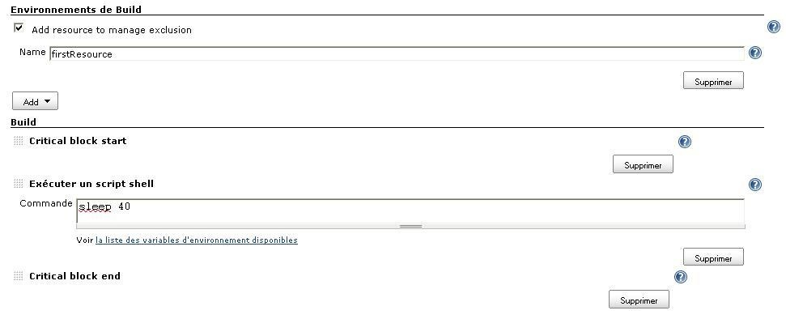
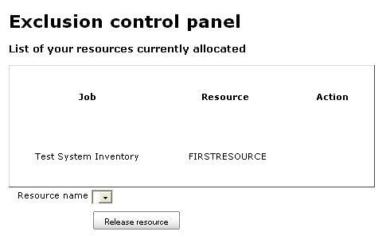

= Exclusion
:toc:
:toc-placement!:
:toc-title:
ifdef::env-github[]
:tip-caption: :bulb:
:note-caption: :information_source:
:important-caption: :heavy_exclamation_mark:
:caution-caption: :fire:
:warning-caption: :warning:
endif::[]

https://ci.jenkins.io/job/Plugins/job/exclusion-plugin/job/master/[image:https://ci.jenkins.io/job/Plugins/job/exclusion-plugin/job/master/badge/icon[Build Status]]
https://github.com/jenkinsci/exclusion-plugin/graphs/contributors[image:https://img.shields.io/github/contributors/jenkinsci/exclusion-plugin.svg[Contributors]]
https://plugins.jenkins.io/Exclusion[image:https://img.shields.io/jenkins/plugin/v/Exclusion.svg[Jenkins Plugin]]
https://github.com/jenkinsci/exclusion-plugin/releases/latest[image:https://img.shields.io/github/release/jenkinsci/exclusion-plugin.svg?label=changelog[GitHub release]]
https://plugins.jenkins.io/Exclusion[image:https://img.shields.io/jenkins/plugin/i/Exclusion.svg?color=blue[Jenkins Plugin Installs]]

This plugin manages exclusions between jobs.

toc::[]

== Introduction

This plugin is inspired by the https://plugins.jenkins.io/port-allocator/[Port Allocator] plugin.

The purpose of this plugin is to manage conflicts between jobs.

The Exclusion plugin allows you to assign resource names to jobs on Jenkins.
The plugin will ensure that jobs sharing a same resource will not be executed at the same time.
The resource name is a semaphore.

With the second part of the plugin you can, in an administration panel, see the list of resources configured in each job, see when a resource is allocated and, thanks to the release button, you can release a resource currently used.

== Configuration

Firstly you have to activate the plugin by checking the box "Add resource to manage exclusion".
It allows you to add resources.
A resource is represented by a name (String).
You can add as many resources as needed.

Secondly you have to determine the critical zone, delimited by a start (Critical Block Start) and an end (Critical Block End).
All build steps included in a critical zone will be managed by Exclusion plugin.

If you don't add a start block the plugin won't do anything.
If you don't add an end block, resources will be release after the last build step.

== Administration Panel

When you are on the home page of Jenkins, you can access the Administration Panel.

In this page, you can see all resources configured.
The status (Action) of a job is set to "Currently Used" when the job is running (if he has a resource configured).
It means that the resource is currently allocated -> the other jobs using the same resource can't be run at this moment.

You can release a resource by selecting a resource name in the combo box (that displays only the resources currently used) and clicking on "Release resource button".

== About me

Owner & maintainer of the project: GitHub: https://github.com/anthonyroux[anthonyroux] & Twitter: https://twitter.com/AnthonyRoux_[AnthonyRoux_]

== Issues

Report issues and enhancements in the https://issues.jenkins.io/[Jenkins issue tracker]. Use the `exclusion-plugin` component in the `JENKINS` project.

== Contributing

Refer to our https://github.com/jenkinsci/.github/blob/master/CONTRIBUTING.md[contribution guidelines].
